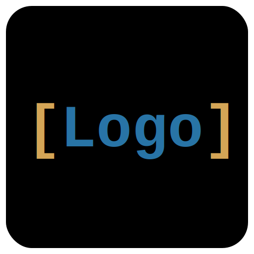

# CLASP

<p align="center">
  
</p>

<h3 align="center">Coding in Logo to Attack Serious Problems</h3>

<p align="center">
  A modern, feature-rich IDE for the Logo programming language
</p>

<p align="center">
  <a href="#features">Features</a> •
  <a href="#screenshot">Screenshot</a> •
  <a href="#installation">Installation</a> •
  <a href="#quick-start">Quick Start</a> •
  <a href="#documentation">Documentation</a>
</p>

---

## About

**CLASP** is a modern integrated development environment for the [Logo programming language](https://en.wikipedia.org/wiki/Logo_(programming_language)), built with Python and PyQt6. Logo is far more than "that turtle graphics language"—it's a full-featured language with powerful list processing, recursion, and functional programming capabilities.

CLASP provides everything you need to explore Logo as a serious programming language, from learning computational thinking to implementing algorithms and data structures.

## Screenshot

<p align="center">
  
</p>

## Features

### 📝 **Smart Code Editor**
- Syntax highlighting for Logo keywords, comments, and strings
- Line numbers display
- Bracket matching for parentheses and brackets
- Tab-based multi-file editing

### 🖥️ **Interactive Terminal**
- REPL (Read-Eval-Print Loop) for immediate command execution
- Run Logo commands and see results instantly
- Reset interpreter state at any time

### 📁 **Integrated File Browser**
- Navigate your project directory
- Quick access to Logo files (`.logo`)
- Double-click to open files in the editor

### 🐢 **Turtle Graphics**
- Built-in turtle graphics window
- Standard turtle commands: `forward`, `right`, `left`, `penup`, `pendown`, etc.
- Multi-turtle support with the `CREATETURTLE` and `TELL` commands
- Toggle graphics window with `Ctrl+G`

### 🎨 **Themeable Interface**
- Multiple built-in color themes
- Easy theme switching via the View menu

## Installation

### Prerequisites

- **Python 3.8** or higher
- **pip** (Python package installer)

### Quick Setup

1. **Clone the repository:**
   ```bash
   git clone https://github.com/yourusername/CLASP.git
   cd CLASP
   ```

2. **Run the setup script:**
   ```bash
   chmod +x setup.sh
   ./setup.sh
   ```
   This creates a virtual environment and installs all required dependencies.

3. **Launch CLASP:**
   ```bash
   ./run.sh
   ```

### Manual Installation

If you prefer manual installation:

```bash
# Create virtual environment
python3 -m venv .venv
source .venv/bin/activate

# Install dependencies
pip install -r requirements.txt

# Run the application
python3 -m clasp.main
```

## Quick Start

### Hello, World!

Launch CLASP and type in the terminal:

```logo
print [Hello, World!]
```

### Your First Turtle Drawing

Draw a square:

```logo
repeat 4 [forward 100 right 90]
```

### Define a Procedure

Create reusable code with procedures:

```logo
to square :size
  repeat 4 [forward :size right 90]
end

square 50
square 100
```

### Keyboard Shortcuts

| Shortcut | Action |
|----------|--------|
| `Ctrl+N` | New file |
| `Ctrl+O` | Open file |
| `Ctrl+S` | Save file |
| `Ctrl+Shift+S` | Save As |
| `F5` | Run current file |
| `F9` | Run selected text (or current line) |
| `Ctrl+G` | Toggle graphics window |

## Documentation

CLASP includes comprehensive documentation:

- 📖 **[User Guide](docs/USER-GUIDE.md)** — Complete guide to using the IDE
- 📚 **[Tutorial](docs/TUTORIAL.md)** — Step-by-step Logo programming tutorial
- 📋 **[Language Reference](docs/LANGUAGE-REFERENCE.md)** — Complete list of Logo primitives and commands

### Example Programs

Explore the `examples/` directory for ready-to-run Logo programs:

- `tutorial-examples/` — Programs that accompany the tutorial
- `lang-test-examples/` — Feature demonstrations and language tests

## Technology Stack

- **Python 3** — Core application logic
- **PyQt6** — Cross-platform GUI framework
- **PyLogo** — Logo interpreter (UCBLogo-compatible)

## Project Structure

```
CLASP/
├── clasp/              # Main application package
│   ├── main.py         # Entry point
│   ├── main_window.py  # Main window class
│   ├── editor.py       # Code editor widget
│   ├── terminal.py     # Interactive terminal
│   ├── file_browser.py # File browser panel
│   ├── graphics.py     # Turtle graphics manager
│   ├── interpreter.py  # Logo interpreter wrapper
│   ├── highlighter.py  # Syntax highlighting
│   ├── themes.py       # Color themes
│   └── pylogo/         # PyLogo interpreter package
├── docs/               # Documentation
├── examples/           # Example Logo programs
├── images/             # Icons and screenshots
├── tests/              # Test suite
├── setup.sh            # Setup script
├── run.sh              # Run script
└── requirements.txt    # Python dependencies
```

## Building Standalone Executables

To create a standalone executable with the CLASP icon:

```bash
# Install PyInstaller
pip install pyinstaller

# Build with icon
pyinstaller --onefile --windowed \
    --icon=images/clasp-icon.png \
    --name=CLASP \
    clasp/main.py
```

The executable will be created in the `dist/` directory.

## Contributing

Contributions are welcome! Feel free to:

- Report bugs or suggest features via Issues
- Submit pull requests with improvements
- Add new example programs
- Improve documentation

## License

This project is open source. See the repository for license details.

## Acknowledgments

- **Seymour Papert**, **Wally Feurzeig**, and the MIT team for creating Logo
- **Brian Harvey** for the excellent *Computer Science Logo Style* books
- The **PyLogo** project for the interpreter

---

<p align="center">
  <strong>CLASP</strong> — Making Logo a serious language for serious programmers
</p>
</CodeContent>
<parameter name="EmptyFile">false
